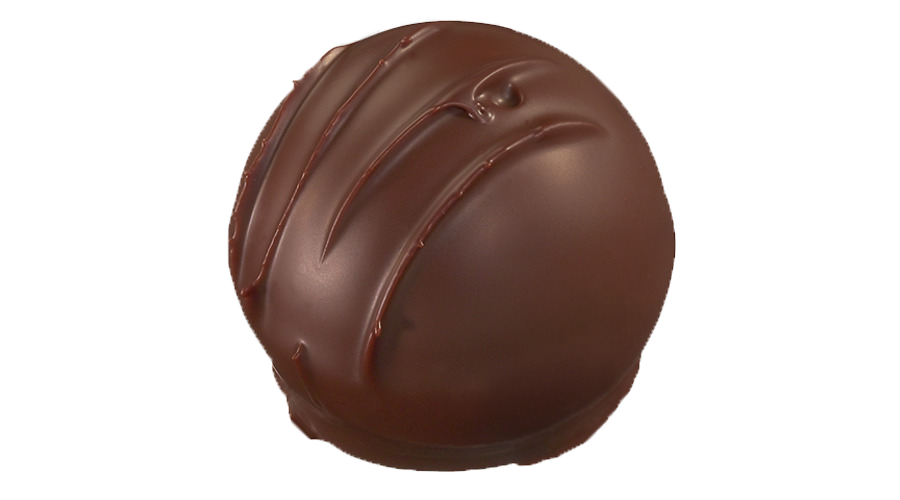

# Chocolate Truffles

<!-- PROJECT LOGO -->
<br />
<p align="center">
  <a href="https://adesuwa-osagie.github.io/chocolate-truffles/">
    
  </a>

  <h3 align="center">Chocolate Truffles</h3>

  <p align="center">
    A tribute page about chocolate truffles. 
  </p>
</p>


<!-- TABLE OF CONTENTS -->
<details open="open">
  <summary><h2 style="display: inline-block">Table of Contents</h2></summary>
  <ol>
    <li>
      <a href="#about-the-project">About The Project</a>
      <ul>
        <li><a href="#built-with">Built With</a></li>
      </ul>
    </li>
    <li>
      <a href="#getting-started">Getting Started</a>
      <ul>
        <li><a href="#prerequisites">Prerequisites</a></li>
        <li><a href="#installation">Installation</a></li>
      </ul>
    </li>
    <li><a href="#contributor">Contributor</a></li>
    <li><a href="#resources">Resources</a></li>
  </ol>
</details>

---

<!-- ABOUT THE PROJECT -->
## About The Project

This is project #1 of freeCodeCamp.com's Responsive Web Design Certification.
<br/>
<br/>

### Built With
<br/>

* 
* 
* 
<br/>
<br/>
---
<!-- GETTING STARTED -->
## Getting Started

To get a local copy up and running follow these simple steps:

### Prerequisites

#### Online
* Visit the <a href="https://adesuwa-osagie.github.io/chocolate-truffles/" target="_blank">tribute page</a>.

#### Offline
1. Clone the repo from the main branch
   ```
   git clone https://github.com/adesuwa-osagie/chocolate-truffles.git
   ```
2. Open the file "index.html" with "Live Server."

### Installation

* No installation required. 
* You may go <a href="https://adesuwa-osagie.github.io/chocolate-truffles/">here</a> to view the tribute page.

---


## Contributor

<br/>

### Adesuwa Osagie
<br/>

[](https://www.linkedin.com/in/adesuwa-osagie/) [](https://github.com/adesuwa-osagie)

---

## Resources

* [Responsive Image Slider](https://www.youtube.com/watch?v=6fivjkF9BOo&t=2s)

* [Tip for using images with different sizes](https://stackoverflow.com/questions/41758544/bootstrap-image-slider-different-image-size)

* [Changing the bullets to images](http://css-workshop.com/css-ul-custom-bullet-style-with-image/)

* [Making a curvy (i.e. SVG) background](https://www.shapedivider.app/)